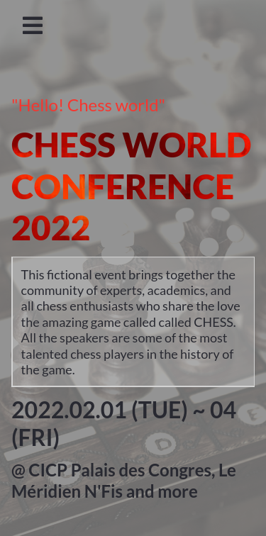
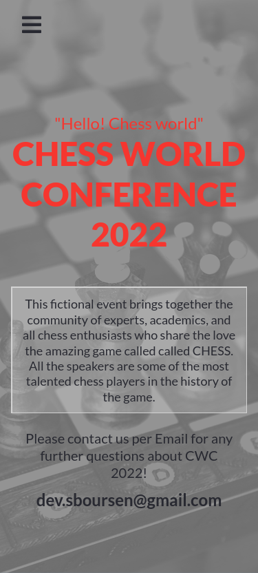

# CHESS WORLD CONFERENCE

**Welcome to my HTML/CSS and JavaScript basics capstone project on github !!!**

It's a website about a Chess conference held in Marrakech, Morocco.

  
Please click to view more screenshots

> About page desktop version:

> Home page mobile version:

> About page mobile version:

## Built With

- HTML
- CSS
- Javascript

## Live Demo

[Live Link](https://sboursen.github.io/Chess-World-Championship/)

## About me

👤 **Soufiane Boursen**

- GitHub: [@Sboursen](https://github.com/Sboursen)
- Twitter: [@sboursen_dev](https://twitter.com/sboursen_dev)
- LinkedIn: [LinkedIn](https://linkedin.com/in/sboursen)

## Contributors

> Kudos to these wonderful
> people who brought my attention
> to multiple issue with
> this project 🙏🙏🙏

- [Alex](https://github.com/harlexkhal)
- [Dagic](https://github.com/Dagic-zewdu)
- [David](https://github.com/daudi13)

## Show your support

Give a ⭐️ if you like this project

## 📝 License

This project is [MIT](./MIT.md) licensed.

## Acknowledgements

- Original design idea by [Cindy Shin in Behance](https://www.behance.net/adagio07)

- Original favicon design by [DG-RA](https://openclipart.org/detail/275251/chess-piece-symbol-black-queen-dama-negra)

- Headline section background photo by [cottonbro from Pexels](https://www.pexels.com/photo/chess-pieces-on-chess-board-4973821/)

- Chess players photos from [World of chess website](https://worldchesshof.org/chess-hall-of-fame/world-chess-hall-of-fame)

- Chess tournaments information from [Wikipedia](https://en.wikipedia.org/wiki/List_of_strong_chess_tournaments#1850%E2%80%931859)
